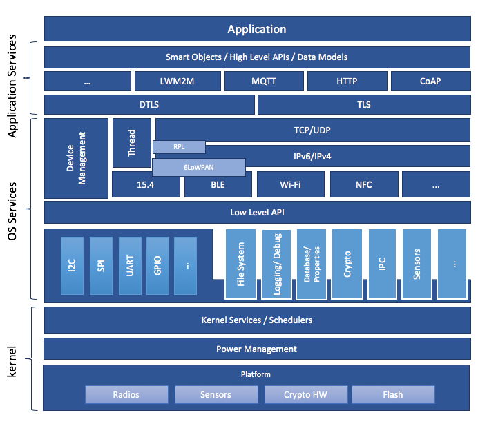
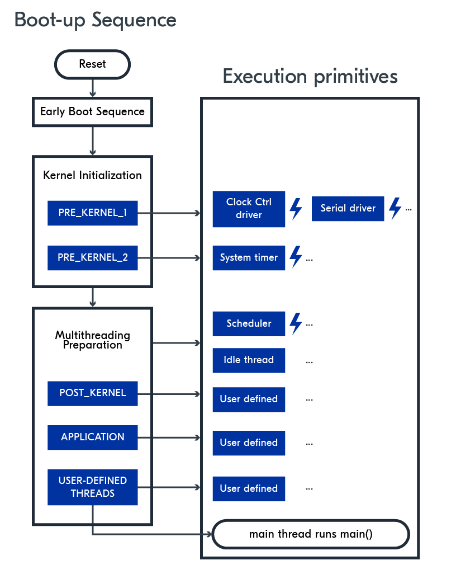

# 1 [System Architecture](https://docs.zephyrproject.org/latest/security/security-overview.html#system-architecture)



# 2 [Architecture Porting Guide](https://docs.zephyrproject.org/latest/hardware/porting/arch.html#architecture-porting-guide)



# 3 芯片启动流程

从这个角度可以更好地分析芯片启动流程，以 RISC-V 芯片为例。

## 3.0 原型定义

1. `GTEXT` 和 `SECTION_FUNC` 的原型在 `zephyr/include/zephyr/toolchain/gcc.h` 中定义：

    - `GTEXT` 如下所示，即定义一个全局的 symbol，类型为 function；

    ```assembly
    #define GTEXT(sym) .global sym; .type sym, %function
    #define GDATA(sym) .global sym; .type sym, %object
    #define WTEXT(sym) .weak sym; .type sym, %function
    #define WDATA(sym) .weak sym; .type sym, %object
    ```

2. `SECTION_FUNC` 的原型如下所示，即定义一个段，该段段名为 `.sect.sym`，可执行可分配；

    - `FUNC_CODE()` 在 RISC-V 中没有具体含义；
    - `PERFOPT_ALIGN` 在 `zephyr/include/zephyr/toolchain/common.h` 中定义，原型为 `#define PERFOPT_ALIGN .balign 4`，强制下一条指令按 4 字节对齐；
    - `sym` 即该函数名；
    - `FUNC_INSTR(sym)` 在 RISC-V 中没有具体含义。

    ```assembly
    #define FUNC_CODE()
    #define FUNC_INSTR(a)
    ······
    #define SECTION_VAR(sect, sym)  .section .sect.sym; sym:
    #define SECTION_FUNC(sect, sym)                                         \
            .section .sect.sym, "ax";                                       \
                                    FUNC_CODE()                             \
                                    PERFOPT_ALIGN; sym :            \
                                                            FUNC_INSTR(sym)
    #define SECTION_SUBSEC_FUNC(sect, subsec, sym)                          \
                    .section .sect.subsec, "ax"; PERFOPT_ALIGN; sym :
    ```

## 3.1 `zephyr/soc/telink/tlsr/tlsr951x/start.S`

```assembly
/*
 * Copyright (c) 2021 Telink Semiconductor
 *
 * SPDX-License-Identifier: Apache-2.0
 */

#define NDS_MCACHE_CTL               0x7CA
#define NDS_MMISC_CTL                0x7D0

#include <zephyr/toolchain.h>

	.option push
	.option norelax
	.org 0x0

/* exports */
GTEXT(entry)

SECTION_FUNC(init, init)
entry:

	j start

	.org 0x20
	.word ('T'<<24 | 'L'<<16 | 'N'<<8 | 'K')

	.org 0x26
	.short (0x173B)

	.align 2

start:

	/* Enable I/D-Cache */
	csrr   t0,  NDS_MCACHE_CTL
	ori    t0,  t0,  1        #/I-Cache
	ori    t0,  t0,  2        #/D-Cache
	csrw   NDS_MCACHE_CTL,  t0
	fence.i

	/* Enable misaligned access and non-blocking load */
	li t0, (1 << 8) | (1 << 6)
	csrs NDS_MMISC_CTL, t0

_ZERO_AES:
	lui    t0, 0
	la     t2, _AES_DATA_VMA_START
	la     t3, _AES_DATA_VMA_END
_ZERO_AES_BEGIN:
	bleu   t3, t2, _RETENTION_DATA_INIT
	sw     t0, 0(t2)
	addi   t2, t2, 4
	j      _ZERO_AES_BEGIN

_RETENTION_DATA_INIT:
	la     t1, _RETENTION_DATA_LMA_START
	la     t2, _RETENTION_DATA_VMA_START
	la     t3, _RETENTION_DATA_VMA_END
_RETENTION_DATA_INIT_BEGIN:
	bleu   t3, t2, _RAMCODE_INIT
	lw     t0, 0(t1)
	sw     t0, 0(t2)
	addi   t1, t1, 4
	addi   t2, t2, 4
	j      _RETENTION_DATA_INIT_BEGIN

_RAMCODE_INIT:
	la     t1, _RAMCODE_LMA_START
	la     t2, _RAMCODE_VMA_START
	la     t3, _RAMCODE_VMA_END
_RAMCODE_INIT_BEGIN:
	bleu   t3, t2, _START
	lw     t0, 0(t1)
	sw     t0, 0(t2)
	addi   t1, t1, 4
	addi   t2, t2, 4
	j      _RAMCODE_INIT_BEGIN

_START:
	j __start

	.option pop

```

该文件为芯片最早执行的启动文件：

1. `.option push` 是汇编语言中的一个指令，主要用于**保存当前的编译器选项状态**；

2. `norelax`：禁止链接器对地址表达式进行优化（即 “放松” 处理）；

3. `SECTION_FUNC(init, init)`：定义一个 `.init.init` 段的函数；

4. `entry` 跳转到 `start`，`.align 2` 使 `start` 函数按 2^2^ 字节处对齐；

5. 开启 Cache；

6. `.aes` 段初始化（TL321X 和 TL721X 可移除）；

7. `.retention_data` 段数据初始化；

8. `.ramcode` 段初始化；

9.  `j __start` 跳转到 `__start`，`__start` 即内核入口符号，在 linker 文件中使用——`ENTRY(CONFIG_KERNEL_ENTRY)`；

    此处跳转到 `zephyr/soc/common/riscv-privileged/vector.S`。

    ```Kconfig
    config KERNEL_ENTRY
    	string "Kernel entry symbol"
    	default "__start"
    	help
    	  Code entry symbol, to be set at linking phase.
    ```

10. `.option pop` 恢复之前保存的编译器选项状态。

## 3.2 `zephyr/soc/common/riscv-privileged/vector.S`

```assembly
/*
 * Copyright (c) 2017 Jean-Paul Etienne <fractalclone@gmail.com>
 * Contributors: 2018 Antmicro <www.antmicro.com>
 *
 * SPDX-License-Identifier: Apache-2.0
 */

#include <zephyr/toolchain.h>

/* exports */
GTEXT(__start)

/* imports */
GTEXT(__initialize)
#if defined(CONFIG_GEN_SW_ISR_TABLE)
GTEXT(_isr_wrapper)
#endif

SECTION_FUNC(vectors, __start)
#if defined(CONFIG_RISCV_GP)
	/* Initialize global pointer */
	.option push
	.option norelax
	la gp, __global_pointer$
	.option pop
#endif

	.option norvc;

#if defined(CONFIG_SOC_RESET_HOOK)
	call soc_reset_hook
#endif

#if defined(CONFIG_RISCV_VECTORED_MODE)
#if defined(CONFIG_RISCV_HAS_CLIC)

	/*
	 * CLIC vectored mode
	 *
	 * CLIC vectored mode uses mtvec exclusively for exception handling and
	 * mtvec.base must be aligned to 64 bytes (this is done using
	 * CONFIG_RISCV_TRAP_HANDLER_ALIGNMENT)
	 */
#if defined(CONFIG_GEN_SW_ISR_TABLE)
	la t0, _isr_wrapper
#else
	add t0, zero, zero
#endif
	addi t0, t0, 0x03 /* Enable CLIC vectored mode by setting LSB */
	csrw mtvec, t0

	/*
	 * CLIC vectored mode has a similar concept to CLINT vectored mode,
	 * where an interrupt vector table is used for specific interrupts.
	 * However, in CLIC vectored mode, the handler table contains the
	 * address of the interrupt handler instead of an opcode containing a
	 * jump instruction, this is done by leveraging
	 * CONFIG_IRQ_VECTOR_TABLE_JUMP_BY_ADDRESS.
	 * When an interrupt occurs in CLIC vectored mode, the address of the
	 * handler entry from the vector table is loaded and then jumped to in
	 * hardware. This time mtvt is used as the base address for the
	 * interrupt table.
	 */
	la t0, _irq_vector_table
	csrw 0x307, t0 /* mtvt */

#else /* !CONFIG_RISCV_HAS_CLIC */

	/*
	 * CLINT vectored mode
	 *
	 * Set mtvec (Machine Trap-Vector Base-Address Register)
	 * to _irq_vector_table (interrupt vector table). Add 1 to base
	 * address of _irq_vector_table to indicate that vectored mode
	 * is used (LSB = 0x1). CPU will mask the LSB out of
	 * the address so that base address of _irq_vector_table is used.
	 *
	 * NOTE: _irq_vector_table is 256-byte aligned. Incorrect alignment
	 *        of _irq_vector_table breaks this code.
	 */
	la t0, _irq_vector_table /* Load address of interrupt vector table */
	addi t0, t0, 0x01 /* Enable vectored mode by setting LSB */
	csrw mtvec, t0

#endif /* CONFIG_RISCV_HAS_CLIC */

#else /* !CONFIG_RISCV_VECTORED_MODE */

#if defined(CONFIG_RISCV_HAS_CLIC) && !defined(CONFIG_LEGACY_CLIC)

	la t0, _isr_wrapper
	addi t0, t0, 0x03 /* Set mode bits to 3, signifying CLIC. Everything else is reserved. */
	csrw mtvec, t0

#else /* !CONFIG_RISCV_HAS_CLIC || CONFIG_LEGACY_CLIC */

	/*
	 * CLINT direct mode
	 *
	 * Set mtvec (Machine Trap-Vector Base-Address Register)
	 * to _isr_wrapper.
	 */
	la t0, _isr_wrapper
	csrw mtvec, t0

#endif /* CONFIG_RISCV_HAS_CLIC&& !CONFIG_LEGACY_CLIC */

#endif /* CONFIG_RISCV_VECTORED_MODE */

	/* Jump to __reset */
	tail __reset

```

1. `la gp, __global_pointer$`：初始化 gp 指针；

2. `.option norvc;`：禁用压缩指令；

3. `call soc_reset_hook`：soc 复位 hook；

4. 根据 soc 是否支持 CLINT 和 CLIC 配置对应的中断向量表，此处可以发现 soc 支持向量中断和非向量中断；

5. `tail __reset` 是一种**尾调用优化（Tail Call Optimization, TCO）技术**，用于在函数的最后一步直接跳转到另一个函数，而不需要保存当前函数的调用上下文。

    > 实际并不存在 `tail` 指令，这是一条伪指令，编译器会将该指令识别为 `jalr`，可能我们可以参考：
    >
    > [riscv - in RISC-V, what is the difference between jump and tail - Stack Overflow](https://stackoverflow.com/questions/75332258/in-risc-v-what-is-the-difference-between-jump-and-tail)
    >
    > 此处，仅需要理解，这条指令是一条跳转指令即可。

## 3.2 `zephyr/arch/riscv/core/reset.S`

```assembly
/*
 * Copyright (c) 2016 Jean-Paul Etienne <fractalclone@gmail.com>
 * Contributors: 2018 Antmicro <www.antmicro.com>
 *
 * SPDX-License-Identifier: Apache-2.0
 */

#include <zephyr/toolchain.h>
#include <zephyr/linker/sections.h>
#include <zephyr/arch/cpu.h>
#include <zephyr/offsets.h>
#include "asm_macros.inc"

/* exports */
GTEXT(__initialize)
GTEXT(__reset)

/* imports */
GTEXT(z_prep_c)
GTEXT(riscv_cpu_wake_flag)
GTEXT(riscv_cpu_sp)
GTEXT(arch_secondary_cpu_init)

#if CONFIG_INCLUDE_RESET_VECTOR
SECTION_FUNC(reset, __reset)
	/*
	 * jump to __initialize
	 * use call opcode in case __initialize is far away.
	 * This will be dependent on linker.ld configuration.
	 */
	call __initialize
#endif /* CONFIG_INCLUDE_RESET_VECTOR */

/* use ABI name of registers for the sake of simplicity */

/*
 * Remainder of asm-land initialization code before we can jump into
 * the C domain
 */
SECTION_FUNC(TEXT, __initialize)
	csrr a0, mhartid
	li t0, CONFIG_RV_BOOT_HART
	beq a0, t0, boot_first_core
	j boot_secondary_core

boot_first_core:

#ifdef CONFIG_FPU
	/*
	 * Enable floating-point.
	 */
	li t0, MSTATUS_FS_INIT
	csrs mstatus, t0

	/*
	 * Floating-point rounding mode set to IEEE-754 default, and clear
	 * all exception flags.
	 */
	fscsr zero
#endif

#ifdef CONFIG_INIT_STACKS
	/* Pre-populate all bytes in z_interrupt_stacks with 0xAA */
	la t0, z_interrupt_stacks
	/* Total size of all cores' IRQ stack */
	li t1, __z_interrupt_all_stacks_SIZEOF
	add t1, t1, t0

	/* Populate z_interrupt_stacks with 0xaaaaaaaa */
	li t2, 0xaaaaaaaa
aa_loop:
	sw t2, 0x00(t0)
	addi t0, t0, 4
	blt t0, t1, aa_loop
#endif /* CONFIG_INIT_STACKS */

	/*
	 * Initially, setup stack pointer to
	 * z_interrupt_stacks + __z_interrupt_stack_SIZEOF
	 */
	la sp, z_interrupt_stacks
	li t0, __z_interrupt_stack_SIZEOF
	add sp, sp, t0

#ifdef CONFIG_WDOG_INIT
	call _WdogInit
#endif

	/*
	 * Jump into C domain. z_prep_c zeroes BSS, copies rw data into RAM,
	 * and then enters kernel z_cstart
	 */
	call z_prep_c

boot_secondary_core:
#if CONFIG_MP_MAX_NUM_CPUS > 1
	la t0, riscv_cpu_wake_flag
	li t1, -1
	sr t1, 0(t0)
	la t0, riscv_cpu_boot_flag
	sr zero, 0(t0)

wait_secondary_wake_flag:
	la t0, riscv_cpu_wake_flag
	lr t0, 0(t0)
	bne a0, t0, wait_secondary_wake_flag

	/* Set up stack */
	la t0, riscv_cpu_sp
	lr sp, 0(t0)

	la t0, riscv_cpu_boot_flag
	li t1, 1
	sr t1, 0(t0)
	j arch_secondary_cpu_init
#else
	j loop_unconfigured_cores
#endif

loop_unconfigured_cores:
	wfi
	j loop_unconfigured_cores

```

1. `SECTION_FUNC(reset, __reset)` 的作用是跳转到 `__initialize`;

    ```assembly
    #if CONFIG_INCLUDE_RESET_VECTOR
    SECTION_FUNC(reset, __reset)
    	/*
    	 * jump to __initialize
    	 * use call opcode in case __initialize is far away.
    	 * This will be dependent on linker.ld configuration.
    	 */
    	call __initialize
    #endif /* CONFIG_INCLUDE_RESET_VECTOR */
    ```

2. `__initialize` 的作用如下：

    - `csrr a0, mhartid`：`mhartid`（Machine Hart ID Register）是 RISC-V 架构中的一个控制和状态寄存器（CSR），用于存储当前硬件线程（hart）的标识符（用于多核心使用）；
    - `li t0, CONFIG_RV_BOOT_HART`：代表设置 SMP 核的起始 HART ID；
    - `beq a0, t0, boot_first_core`：如果当前核心 ID（`a0`）等于主核心 ID（`t0`），跳转到 `boot_first_core` 执行主核心初始化，否则，`j boot_secondary_core` 跳转到 `boot_secondary_core` 执行从核心初始化；

    ```assembly
    /* use ABI name of registers for the sake of simplicity */
    
    /*
     * Remainder of asm-land initialization code before we can jump into
     * the C domain
     */
    SECTION_FUNC(TEXT, __initialize)
    	csrr a0, mhartid
    	li t0, CONFIG_RV_BOOT_HART
    	beq a0, t0, boot_first_core
    	j boot_secondary_core
    ```

3. `boot_first_core` 作用如下：

    - `CONFIG_FPU` 处配置的是浮点数操作；
    - `CONFIG_INIT_STACKS` 处，`z_interrupt_stacks` 为中断栈首地址，`__z_interrupt_all_stacks_SIZEOF` 为中断栈大小，循环将中断栈赋值为 `0xFF`；
    - 设置堆栈指针；
    - 初始化看门狗；
    - `call z_prep_c` 转到 C 程序入口；

    ```assembly
    boot_first_core:
    
    #ifdef CONFIG_FPU
    	/*
    	 * Enable floating-point.
    	 */
    	li t0, MSTATUS_FS_INIT
    	csrs mstatus, t0
    
    	/*
    	 * Floating-point rounding mode set to IEEE-754 default, and clear
    	 * all exception flags.
    	 */
    	fscsr zero
    #endif
    
    #ifdef CONFIG_INIT_STACKS
    	/* Pre-populate all bytes in z_interrupt_stacks with 0xAA */
    	la t0, z_interrupt_stacks
    	/* Total size of all cores' IRQ stack */
    	li t1, __z_interrupt_all_stacks_SIZEOF
    	add t1, t1, t0
    
    	/* Populate z_interrupt_stacks with 0xaaaaaaaa */
    	li t2, 0xaaaaaaaa
    aa_loop:
    	sw t2, 0x00(t0)
    	addi t0, t0, 4
    	blt t0, t1, aa_loop
    #endif /* CONFIG_INIT_STACKS */
    
    	/*
    	 * Initially, setup stack pointer to
    	 * z_interrupt_stacks + __z_interrupt_stack_SIZEOF
    	 */
    	la sp, z_interrupt_stacks
    	li t0, __z_interrupt_stack_SIZEOF
    	add sp, sp, t0
    
    #ifdef CONFIG_WDOG_INIT
    	call _WdogInit
    #endif
    
    	/*
    	 * Jump into C domain. z_prep_c zeroes BSS, copies rw data into RAM,
    	 * and then enters kernel z_cstart
    	 */
    	call z_prep_c
    ```

4. `boot_secondary_core` 作用是初始化第二个核心（此处暂不讨论）。

## 3.3 `zephyr/arch/riscv/core/prep_c.c/z_prep_c`

```C
/**
 *
 * @brief Prepare to and run C code
 *
 * This routine prepares for the execution of and runs C code.
 */

void z_prep_c(void)
{
#if defined(CONFIG_SOC_PREP_HOOK)
	soc_prep_hook();
#endif

	z_bss_zero();
	z_data_copy();
#if defined(CONFIG_RISCV_SOC_INTERRUPT_INIT)
	soc_interrupt_init();
#endif
#if CONFIG_ARCH_CACHE
	arch_cache_init();
#endif
	z_cstart();
	CODE_UNREACHABLE;
}
```

1. `soc_prep_hook` 是一个芯片初始化阶段的 hook；
2. `z_bss_zero`：定义在 `zephyr/kernel/init.c`，用于初始化 `bss` 段；
3. `z_data_copy`：定义在 `zephyr/kernel/xip.c`，用于初始化 `data` 段；
4. `soc_interrupt_init`：用于初始化 soc 的中断配置；
5. `arch_cache_init`：用于初始化 cache 配置；
6. `z_cstart`：定义在 `zephyr/kernel/init.c`，转入 C；
7. `CODE_UNREACHABLE`： 即 `__builtin_unreachable`。

## 3.4 `zephyr/kernel/init.c/z_cstart`

```C
/**
 *
 * @brief Initialize kernel
 *
 * This routine is invoked when the system is ready to run C code. The
 * processor must be running in 32-bit mode, and the BSS must have been
 * cleared/zeroed.
 *
 * @return Does not return
 */
__boot_func
FUNC_NO_STACK_PROTECTOR
FUNC_NORETURN void z_cstart(void)
{
	/* gcov hook needed to get the coverage report.*/
	gcov_static_init();

	/* initialize early init calls */
	z_sys_init_run_level(INIT_LEVEL_EARLY);

	/* perform any architecture-specific initialization */
	arch_kernel_init();

	LOG_CORE_INIT();

#if defined(CONFIG_MULTITHREADING)
	z_dummy_thread_init(&_thread_dummy);
#endif /* CONFIG_MULTITHREADING */
	/* do any necessary initialization of static devices */
	z_device_state_init();

#if CONFIG_SOC_EARLY_INIT_HOOK
	soc_early_init_hook();
#endif
#if CONFIG_BOARD_EARLY_INIT_HOOK
	board_early_init_hook();
#endif
	/* perform basic hardware initialization */
	z_sys_init_run_level(INIT_LEVEL_PRE_KERNEL_1);
#if defined(CONFIG_SMP)
	arch_smp_init();
#endif
	z_sys_init_run_level(INIT_LEVEL_PRE_KERNEL_2);

#ifdef CONFIG_REQUIRES_STACK_CANARIES
	uintptr_t stack_guard;

	z_early_rand_get((uint8_t *)&stack_guard, sizeof(stack_guard));
	__stack_chk_guard = stack_guard;
	__stack_chk_guard <<= 8;
#endif	/* CONFIG_REQUIRES_STACK_CANARIES */

#ifdef CONFIG_TIMING_FUNCTIONS_NEED_AT_BOOT
	timing_init();
	timing_start();
#endif /* CONFIG_TIMING_FUNCTIONS_NEED_AT_BOOT */

#ifdef CONFIG_MULTITHREADING
	switch_to_main_thread(prepare_multithreading());
#else
#ifdef ARCH_SWITCH_TO_MAIN_NO_MULTITHREADING
	/* Custom ARCH-specific routine to switch to main()
	 * in the case of no multi-threading.
	 */
	ARCH_SWITCH_TO_MAIN_NO_MULTITHREADING(bg_thread_main,
		NULL, NULL, NULL);
#else
	bg_thread_main(NULL, NULL, NULL);

	/* LCOV_EXCL_START
	 * We've already dumped coverage data at this point.
	 */
	irq_lock();
	while (true) {
	}
	/* LCOV_EXCL_STOP */
#endif /* ARCH_SWITCH_TO_MAIN_NO_MULTITHREADING */
#endif /* CONFIG_MULTITHREADING */

	/*
	 * Compiler can't tell that the above routines won't return and issues
	 * a warning unless we explicitly tell it that control never gets this
	 * far.
	 */

	CODE_UNREACHABLE; /* LCOV_EXCL_LINE */
}
```

1. `__boot_func` 为一个 boot 相关的段，需定义；
2. `FUNC_NO_STACK_PROTECTOR`：用于修饰函数，其作用是告诉编译器不要为被修饰的函数生成栈保护机制；
3. `gcov_static_init`：GCOV 是 GCC 的代码覆盖率工具，此处无需关注；
4. `z_sys_init_run_level(INIT_LEVEL_EARLY)`：调用优先级为 `INIT_LEVEL_EARLY` 的初始化函数；
5. `arch_kernel_init`：架构相关的内核初始化，主要负责：
    - 线程局部存储初始化；
    - SMP 或用户空间支持；
    - 主 CPU 核心初始化；
    - 多核系统中其他 CPU 核心配置；
    - 内存保护单元初始化；
    - SOC 特定初始化钩子；
6. `LOG_CORE_INIT`：一个内核初始化的打印 hook；
7. `z_dummy_thread_init`：idle 线程初始化，`CONFIG_MULTITHREADING` 表示 zephyr 支持无线程操作，用于：
    - Bootloaders
    - Simple event-driven applications
    - Examples intended to demonstrate core functionality
8. `z_device_state_init`：对静态设备的状态对象进行初始化（与实际功能组件相关）；
9. `soc_early_init_hook`：soc 早期初始化的 hook；
10. `board_early_init_hook`：board 早期初始化的 hook；
11. `z_sys_init_run_level(INIT_LEVEL_PRE_KERNEL_1)`：调用优先级为 `INIT_LEVEL_PRE_KERNEL_1` 的初始化函数；
12. `arch_smp_init`：soc 支持 smp 情况下的初始化；
13. `z_sys_init_run_level(INIT_LEVEL_PRE_KERNEL_2)`：调用优先级为 `INIT_LEVEL_PRE_KERNEL_2` 的初始化函数；
14. `CONFIG_REQUIRES_STACK_CANARIES` 处：栈保护机制；
15. `CONFIG_TIMING_FUNCTIONS_NEED_AT_BOOT` 处：初始化和启动系统计时功能的核心逻辑，主要用于性能分析和调试；
16. `switch_to_main_thread(prepare_multithreading())`：切换到主线程的一些处理逻辑。

## 3.5 `zephyr/kernel/init.c/switch_to_main_thread`

```C
__boot_func
static FUNC_NORETURN void switch_to_main_thread(char *stack_ptr)
{
#ifdef CONFIG_ARCH_HAS_CUSTOM_SWAP_TO_MAIN
	arch_switch_to_main_thread(&z_main_thread, stack_ptr, bg_thread_main);
#else
	ARG_UNUSED(stack_ptr);
	/*
	 * Context switch to main task (entry function is _main()): the
	 * current fake thread is not on a wait queue or ready queue, so it
	 * will never be rescheduled in.
	 */
	z_swap_unlocked();
#endif /* CONFIG_ARCH_HAS_CUSTOM_SWAP_TO_MAIN */
	CODE_UNREACHABLE; /* LCOV_EXCL_LINE */
}
```

此处不考虑 `CONFIG_ARCH_HAS_CUSTOM_SWAP_TO_MAIN` 的情况，API `z_swap_unlocked` 的核心为 `do_swap`，用于切换线程的上下文。