# 1 Basic Concept

## 1.1 Paring and Bonding

**Paring（配对）** ，配对包括配对能力交换，设备认证，密钥生成，连接加密以及机密信息分发等过程，配对的目的有三个：加密连接，认证设备，以及生成密钥。从手机角度看，一旦设备跟手机配对成功，蓝牙配置菜单将包含该配对设备，如下所示：

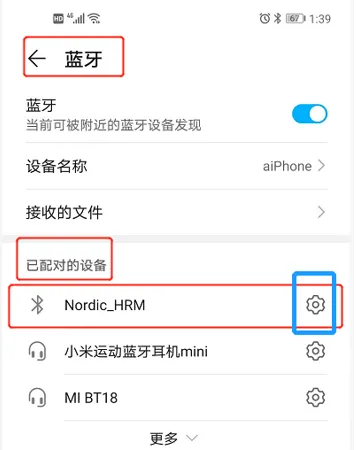

如果用户需要主动删除配对设备，点击配对设备右边的“设置”菜单，出现如下界面，选择“取消配对”或者“忽略该设备”，设备的配对信息即被手机删除。

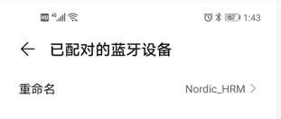

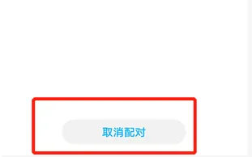

**Bonding（绑定）** ，配对过程中会生成一个长期密钥（LTK，long-term Key），如果配对双方把这个LTK存储起来放在Flash中，那么这两个设备 **再次重连** 的时候，就可以跳过配对流程，而直接使用LTK对蓝牙连接进行加密，设备的这种状态称为bonding。如果paring过程中不存储LTK（不分发LTK）也是可以的，paring完成后连接也是加密的，但是如果两个设备再次重连，那么就需要重走一次paring流程，否则两者还是明文通信。

在不引起误解的情况下，我们经常把paring当成paring和bonding两者的组合，因为只paring不bonding的应用情况非常少见。在不引起混淆的情况下，下文就不区分paring和bonding的区别，换句话说，我们会把paring和bonding两个概念等同起来进行混用。

## 1.2 Others

**SM（security manager）** ，蓝牙协议栈的安全管理层，规定了跟蓝牙安全通信有关的所有要素，包括paring，bonding，以及下文提到的SMP。

**SMP（security manager protocol）** ，安全管理协议，SMP着重两个设备之间的蓝牙交互命令序列，对paring的空中包进行了严格时序规定。

**OOB（out of band，带外）** ，OOB就是不通过蓝牙射频本身来交互，而是通过比如人眼，NFC，UART等带外方式来交互配对信息，在这里人眼，NFC，UART通信方式就被称为OOB通信方式。

**Passkey** ，又称pin码，是指用户在键盘中输入的一串数字，以达到认证设备的目的。低功耗蓝牙的passkey必须为6位。

**Numeric comparison** （数字比较），numeric comparison其实跟passkey一样，也是用来认证设备的，只不过passkey是通过键盘输入的，而numeric comparison是显示在显示器上的，numeric comparison也必须是6位的数字。

**MITM（man in the middle）** ，MITM是指A和B通信过程中，C会插入进来以模拟A或者B，并且具备截获和篡改A和B之间所有通信报文的能力，从而达到让A或者B信任它，以至于错把C当成B或者A来通信。如果对安全要求比较高，需要具备MITM保护能力，在SM中这个是通过认证（authentication）来实现的，SM中实现认证的方式有三种：OOB认证信息，passkey以及numeric comparison，大家根据自己的实际情况，选择其中一种即可。

**LESC（LE secure connections）** ，又称SC，蓝牙4.2引入的一种新的密钥生成方式和验证方式，SC通过基于椭圆曲线的Diffie-Hellman密钥交换算法来生成设备A和B的共享密钥，此密钥生成过程中需要用到公私钥对，以及其他的密码算法库。LESC同时还规定了相应的通信协议以生成该密钥，并验证该密钥。需要注意的是LESC对paring的其他方面也会产生一定的影响，所以我们经常会把LESC看成是一种新的配对方式。

**Legacy paring** ，在LESC引入之前的密钥生成方式，称为legacy paring，换句话说，legacy paring是相对LESC来说的，不支持LESC的配对即为legacy paring（legacy配对）。

**TK（Temporary Key，临时密钥）** ，legacy paring里面的概念，如果采用just work配对方式，TK就是为全0；如果采用passkey配对方式，TK就是passkey；如果采用OOB配对方式，TK就是OOB里面的信息。

**STK（short term key，短期密钥）** ，legacy配对里面的概念，STK是通过TK推导出来的，通过TK对设备A和B的随机数进行加密，即得到STK。

**LTK（long term key，长期密钥）** ，legacy配对和LESC配对都会用到LTK，如前所述，LTK是用来对未来的连接进行加密和解密用的。Legacy paring中的LTK由从设备根据相应的算法自己生成的（LTK生成过程中会用到EDIV（分散因子）和Rand（随机数）），然后通过蓝牙空中包传给主机。LESC配对过程中，先通过Diffie-Hellman生成一个共享密钥，然后这个共享密钥再对设备A和B的蓝牙地址和随机数进行加密，从而得到LTK，LTK由设备A和B各自同时生成，因此LTK不会出现在LESC蓝牙空中包中，大大提高了蓝牙通信的安全性。

**IRK（Identity Resolving Key，蓝牙设备地址解析密钥）** ，有些蓝牙设备的地址为可解析的随机地址，比如iPhone手机，由于他们的地址随着时间会变化，那如何确定这些变化的地址都来自同一个设备呢？答案就是IRK，IRK通过解析变化的地址的规律，从而确定这些地址是否来自同一个设备，换句话说，IRK可以用来识别蓝牙设备身份，因此其也称为Identity information。IRK一般由设备出厂的时候按照一定要求自动生成。

**Identity Address（设备唯一地址）** ，蓝牙设备地址包括 public，random static， private resolvable，random unresolved共四类。如果设备不支持privacy，那么identity address就等于public或者random static设备地址。如果设备支持privacy，即使用private resolvable蓝牙设备地址，在这种情况下，虽然其地址每隔一段时间会变化一次，但是identity address仍然保持不变，其取值还是等于内在的public或者random static设备地址。Identity Address和IRK都可以用来唯一标识一个蓝牙设备。

**IO capabilities（输入输出能力）** ，是指蓝牙设备的输入输出能力，比如是否有键盘，是否有显示器，是否可以输入Yes/No两个确认值。

**Key size（密钥长度）** ，一般来说，密钥默认长度为16字节，为了适应一些低端的蓝牙设备处理能力，你也可以把密钥长度调低，比如变为10个字节。

# 2 Pairing 流程

Paring包含三个阶段：

阶段1：配对特性交换，即交换各自都支持哪些配对特性，比如支不支持 SC，支不支持 MITM，支不支持 OOB，以及它的输入输出能力等。

阶段2：密钥生成阶段，Legacy Paring 和 Secure Connections Paring 两者的区别就在这里，因此后续我们会分开阐述 Legacy Paring 和 Secure Connections Paring 的阶段2。

- Legacy Paring：STK 生成（注：legacy Paring 的 LTK 生成跟配对流程无关，如前所述，其是由从机自己生成的）
- Secure Connections Paring：LTK 生成

阶段3：通过蓝牙空中包分发一些秘密信息。Legacy Paring 需要分发 LTK、IRK 等，而 SC Paring 只需分发 IRK。秘密信息分发之前，必须保证连接已加密。

Paring流程如下所示：

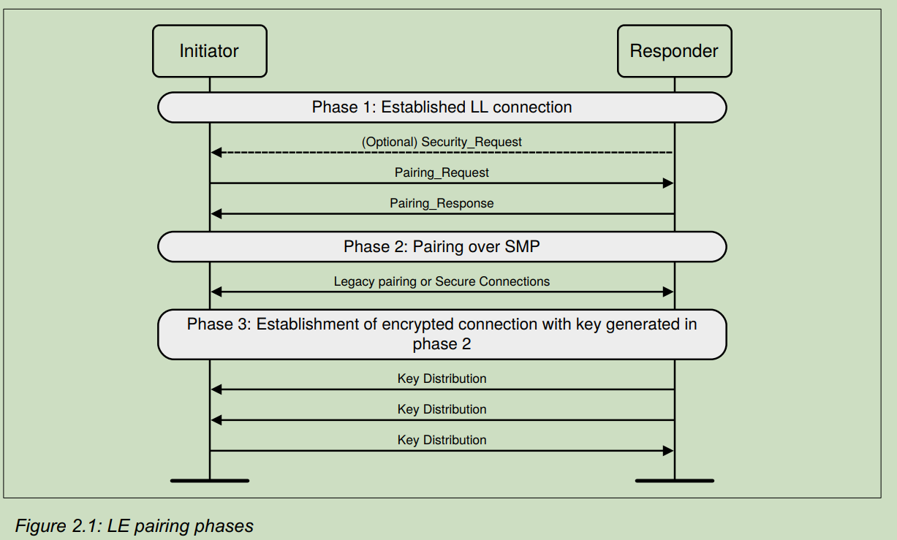

## 2.1 Phase 1: Pairing feature exchange

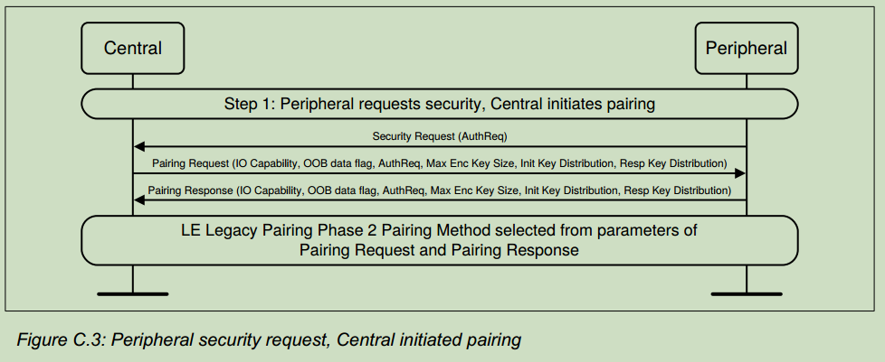

当配对开始时，**配对特性交换（Pairing Feature Exchange）** 应由 **发起设备（initiating device）** 启动。如果响应设备不支持配对，或者无法执行配对，那么响应设备应当使用 **配对失败（Pairing Failed）** 消息进行响应，并携带错误码 **“不支持配对（Pairing Not Supported）”**；否则，它应当使用 **配对响应（Pairing Response）** 消息进行回应。

**配对特性交换（Pairing Feature Exchange）** 用于交换以下信息：IO 能力、OOB 认证数据可用性、认证需求、密钥长度需求，以及需要分发的传输层特定密钥。  
其中，IO 能力、OOB 认证数据可用性和认证需求会用于确定在 **第二阶段（Phase 2）** 中所采用的密钥生成方法。
### Pairing Request

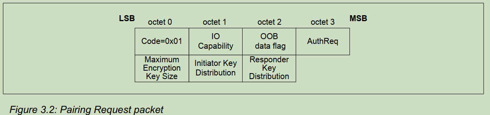

- IO Capability (1 octet)

  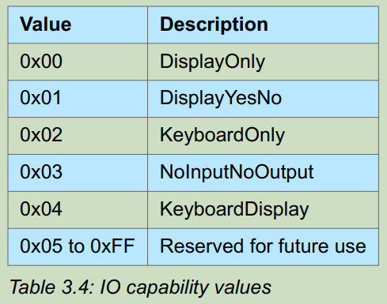

- OOB data flag (1 octet)

  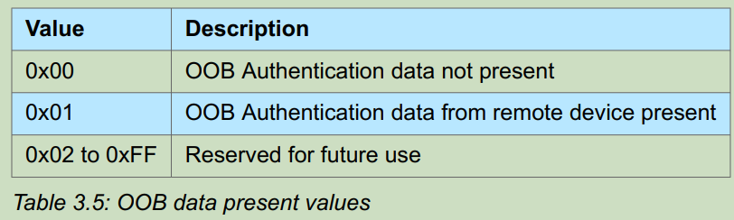

- AuthReq (1 octet)
  
	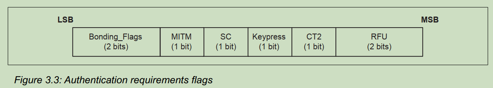
  
	- Bonding_Flags field(2-bit field)
	  
	    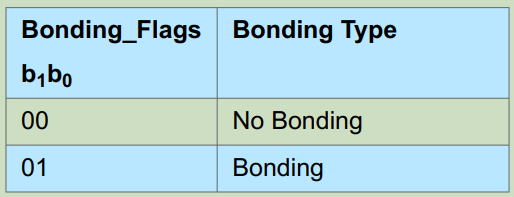
	    
	    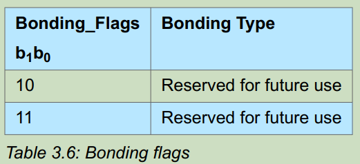
	    
	- MITM(1-bit flag): Man in the Middle
	
	- SC field(1-bit flag): 指示当前设备是否支持 Secure Connection，两端设备都支持才支持 LESC。
	
	- Keypress(1-bit flag): 只在 Passkey Entry protocol 中使用，当双方都将该字段设置为 1 时，应当生成并发送 **按键通知（Keypress notifications）**，其传输使用 **SMP 配对按键通知 PDU（SMP Pairing Keypress Notification PDUs）**。
	
	- CT2 field(1-bit flag): indicate support for the h7 function
	
- Maximum Encryption Key Size (1 octet): 该值定义了设备所能支持的 **最大加密密钥长度**（以字节为单位）。最大密钥长度必须在 **7 到 16 字节**的范围内。
- Initiator Key Distribution / Generation (1 octet): **发起方密钥分发/生成字段（Initiator Key Distribution / Generation field）** 指示发起方在 **传输层特定密钥分发阶段（Transport Specific Key Distribution phase，见第 2.4.3 节）** 请求分发、生成或使用的密钥。
- Responder Key Distribution / Generation (1 octet): **响应方密钥分发/生成字段（Responder Key Distribution / Generation field）** 指示发起方在 **传输层特定密钥分发阶段（Transport Specific Key Distribution phase，见第 2.4.3 节）** 请求响应方分发、生成或使用的密钥。

### Pairing Response

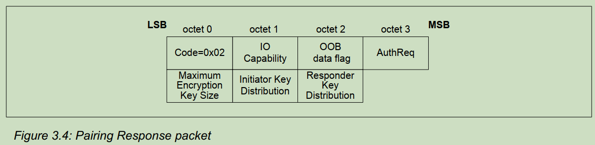

### Security Request

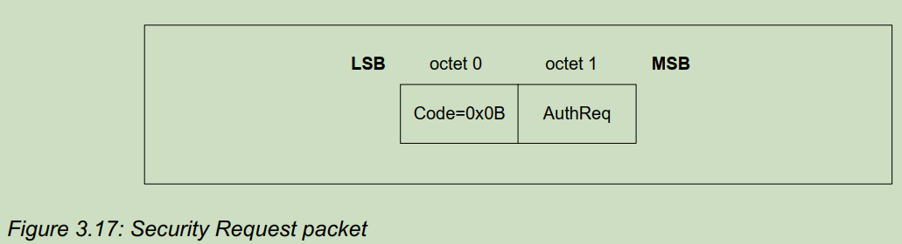

## 2.2 Phase 2: Authenticating and encrypting

根据阶段1的 IO 输入输出能力以及是否存在OOB，阶段2存在如下几种配对方式（或者说认证方式）：
- Just works
- Numeric comparison（LESC才有）
- Passkey
- OOB

如果两端设备都没有在 Authentication Requirements Flags 中设置 MITM 标志，那么 IO 能力会被忽略，Just Works 相关的模型会被使用。

在 Legacy Pairing 中，若两端设备都支持 OOB，则 Authentication Requirements Flags 会被忽略，并使用 OOB 配对方式，否则，设备的 IO 能力会被用于选择配对方式。

在 LE Secure Connections Pairing 中，只要一端设备支持 OOB，则  Authentication Requirements Flags 会被忽略，并使用 OOB 配对方式，否则，设备的 IO 能力会被用于选择配对方式。

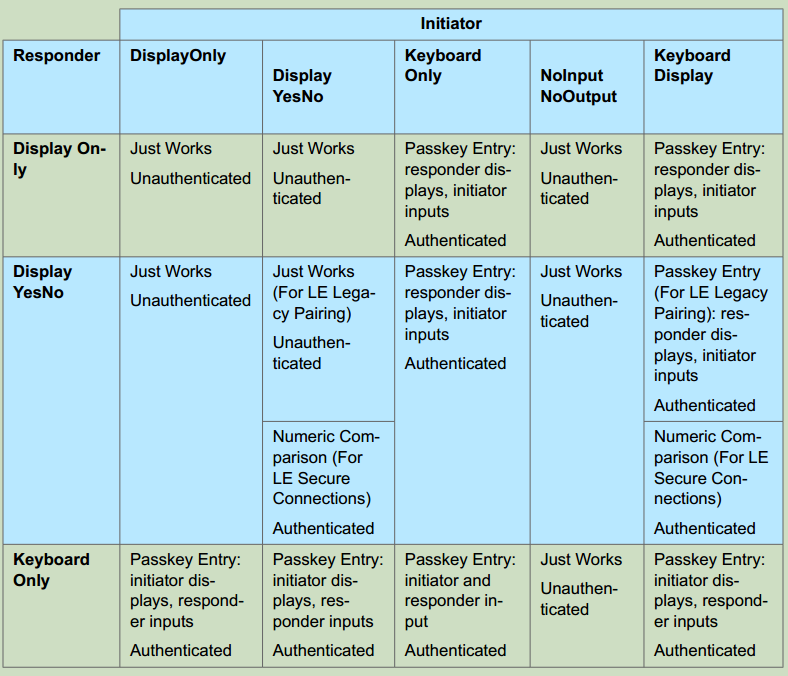

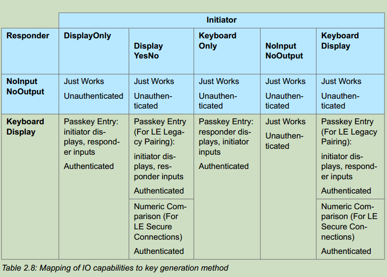

当至少有一个设备不支持 LE Secure Connections 时（即使用 Legacy Pairing）的 STK 生成方法。

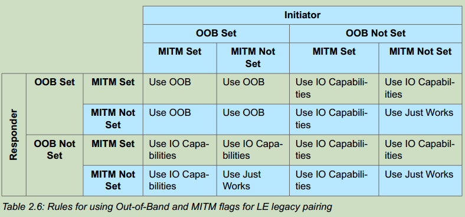

当两个设备都支持 LE Secure Connections 时的 LTK 生成方法。

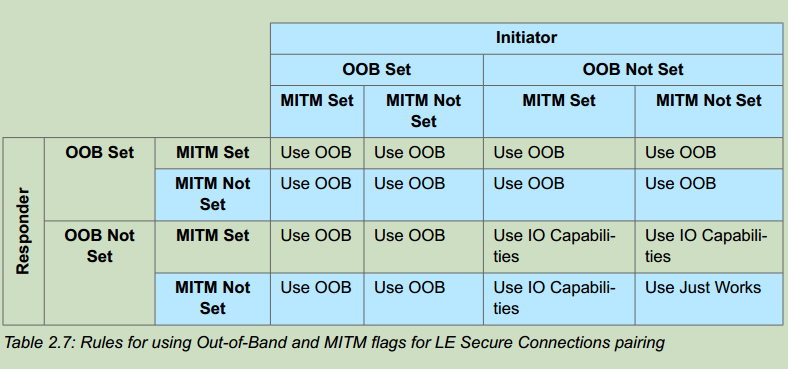

因此，从 IO 能力角度看，有三种配对方式：
- Just works
- Numeric comparison（LESC才有）
- Passkey

其中，Just works 没有 MITM 功能，Passkey 和 Numeric comparison 具有 MITM 功能，也因此，有 MITM 功能，则必须要求有一定的 IO 能力，不能是 NoInputNoOutput。

至于 OOB 方式有没有 MITM 保护，取决于 OOB 通信的安全性，如果 OOB 通信具备 MITM 保护，那么蓝牙也具备 MITM 保护，否则就不具备。
### 2.2.1 Legacy Pairing

Legacy Pairing 的整个流程围绕 STK 生成展开，设备的认证是通过设备 A 和 B 经由 TK 生成一个确认数，如果这个确认数相同，则认证通过。

TK 的生成方式取决于配对方式：
- Just works，TK 默认为全 0；

  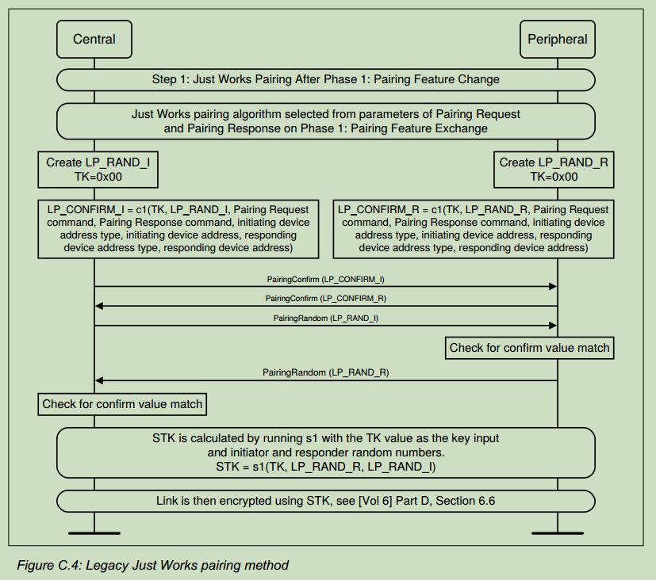

- Passkey，TK 由6位 passkey 扩展而来；

  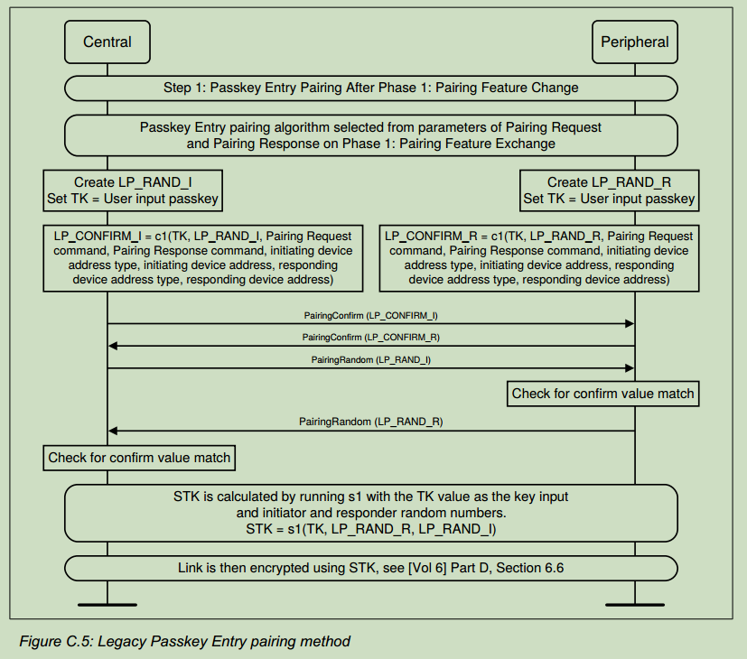

- OOB，TK 直接由 OOB 数据提供。

  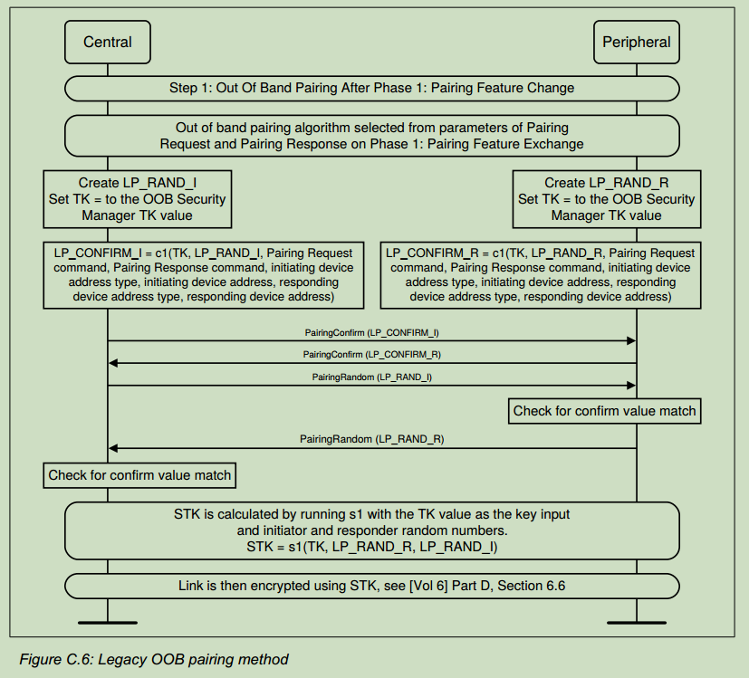

**配对完成之后，连接就会加密，而且加密的密钥是STK，而不是LTK**。（仅第一次配对如此？）

### 2.2.2 LESC Pairing

#### Public Key Exchange

跟 Legacy Paring 不一样的地方，LESC Pairing 是通过 Diffie-Hellman 算法直接生成 LTK，因此它不需要生成 TK 和 STK。为了生成 LTK，双方需要先交换公钥，流程如下所示：

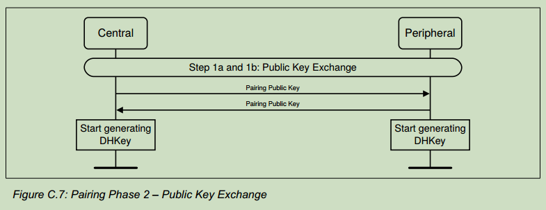

公钥交换后，设备A和B就开始独自计算各自的 DHKey，按照 D-H 算法，他们俩算出的 DHKey会是同一个。而 LTK 和 MacKey 就是通过这个 DHKey 加密一系列数据而得到的。

Legacy Paring 在整个配对流程中只做一次认证，而 LESC Paring 会做两次认证：
1. 设备 A 和 B 各生成一个随机数，然后认证这个随机数对不对；
2. 设备 A 和 B 通过 MacKey 各生成一个检查值，对端设备确认这个值对不对。

#### Authentication stage 1

以 LESC Just Works or Numeric Comparison 为例，其第一阶段认证流程如下所示：

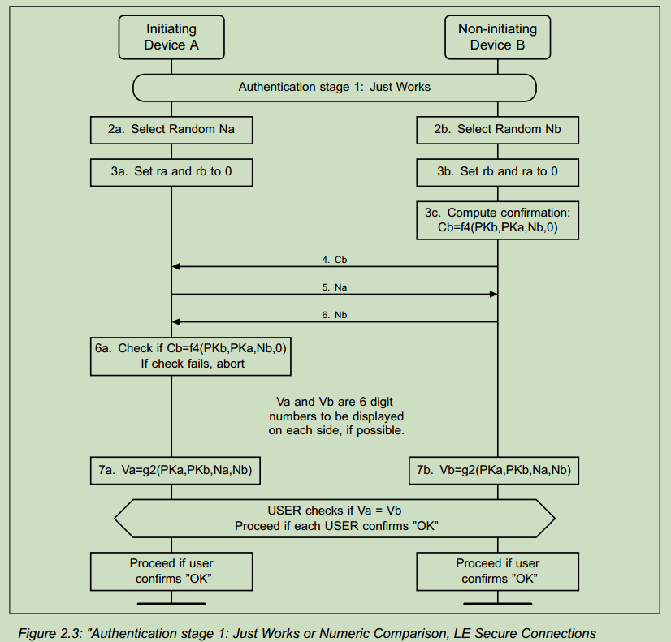

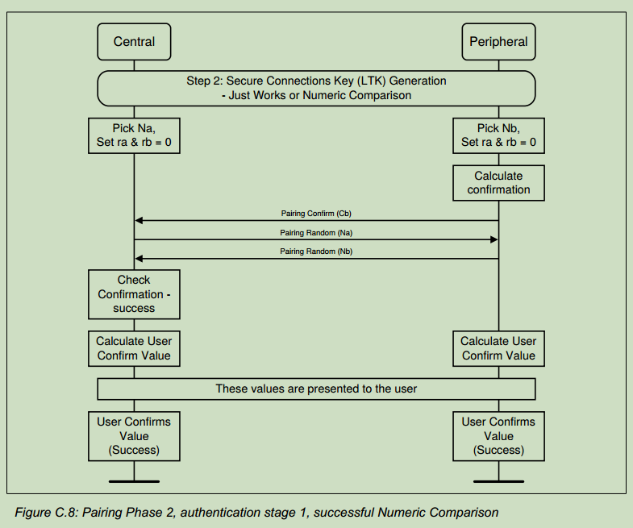

以 LESC Passkey Entry 为例，其第一阶段认证流程如下所示：

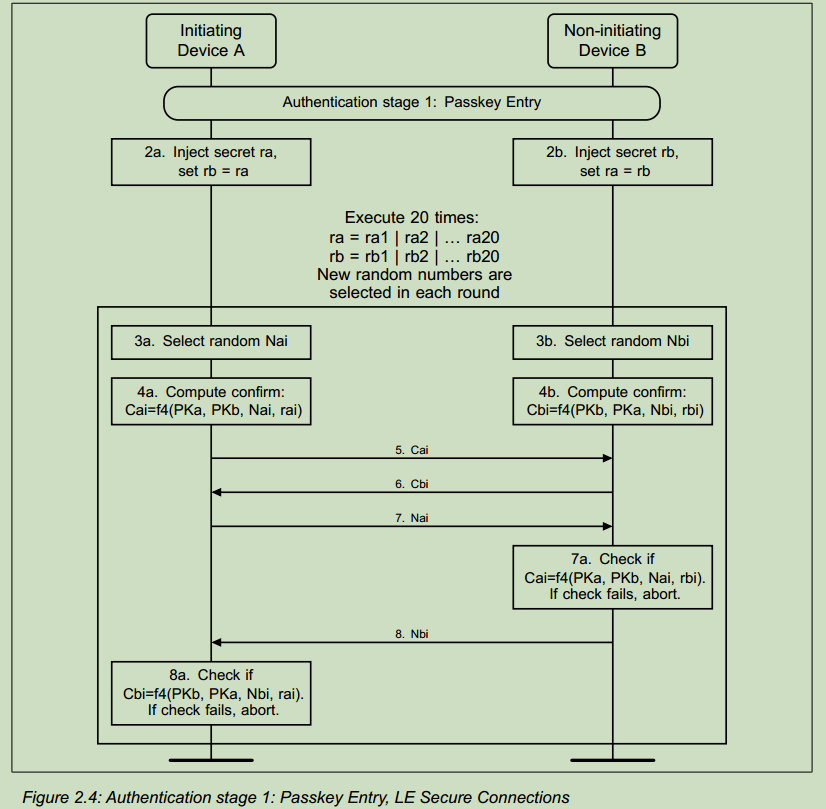

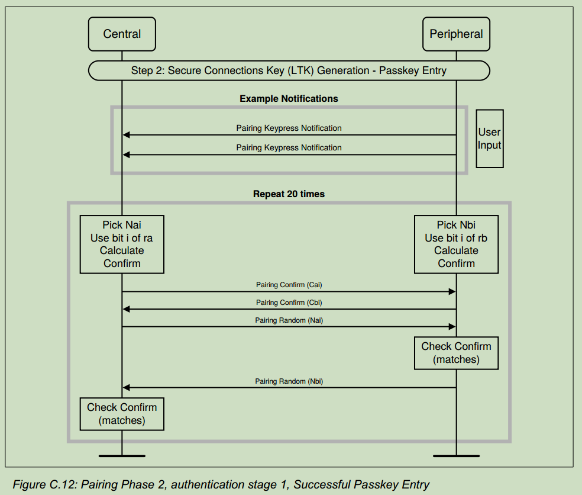

以 LESC OOB 为例，其第一阶段认证流程如下所示：

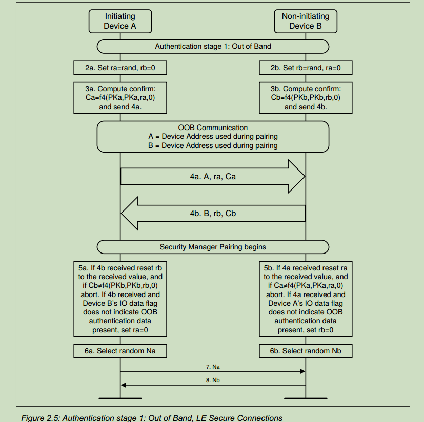

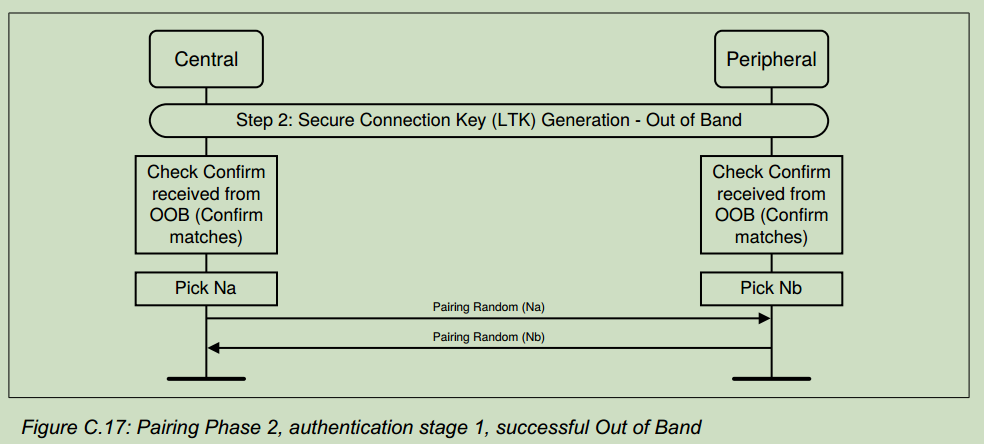
#### Authentication stage 2

第二阶段认证流程如下所示：

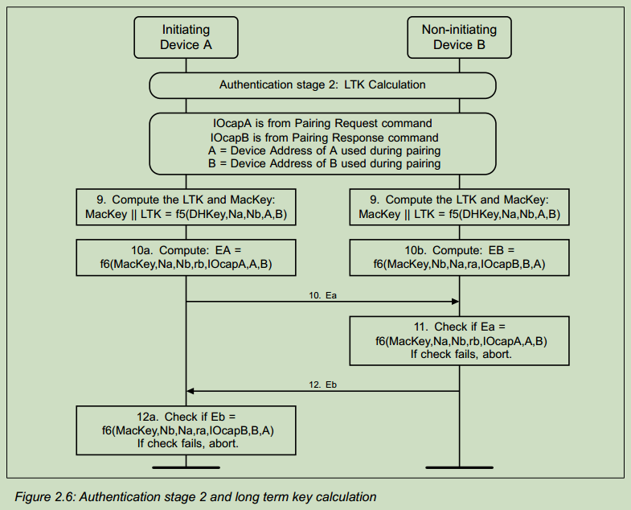

一旦 DHKey 生成完成，即可基于 DHKey 计算 LTK。

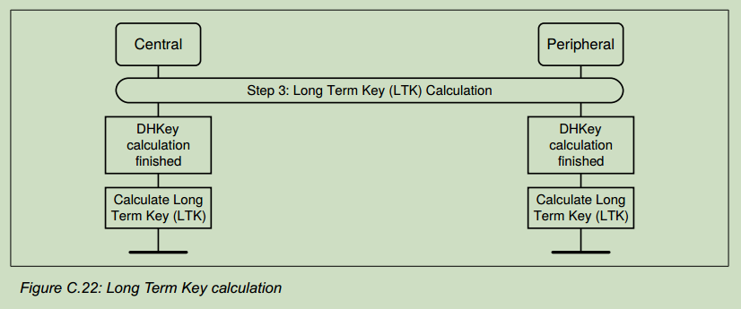

一旦 LTK 计算和认证阶段 1 完成，就会通过交换使用 DHKey 生成的 **DHKey Check** 值来验证生成的 DHKey。

如果验证成功，那么两个设备就已经完成了向用户显示相关信息的过程，因此 Host 可以停止显示这些信息。

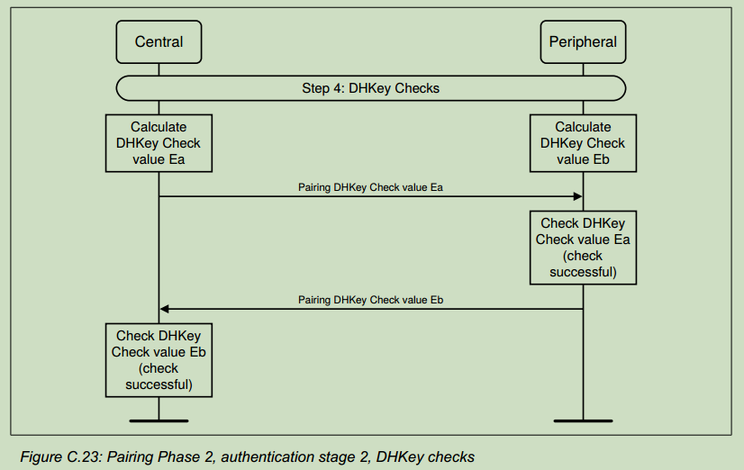

## 2.3 Phase 3: Transport specific key distribution

在 STK 生成后并完成**链路加密**之后，会分发与传输相关的特定密钥。下图展示了 Central 和 Peripheral 各自分发的所有密钥和值的示例。

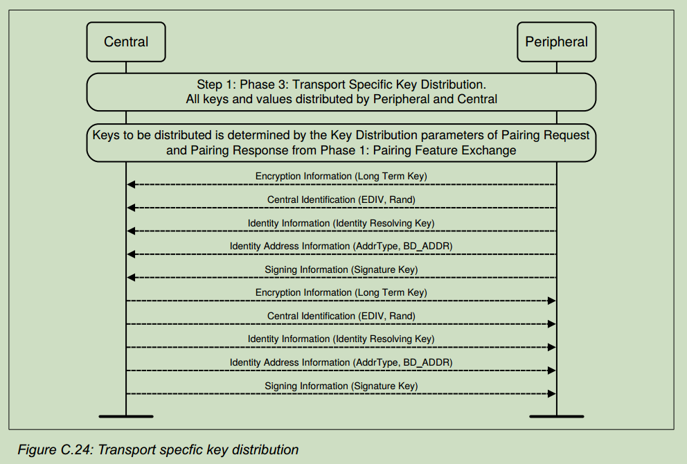

### 2.3.1 LE legacy pairing key distribution

一旦连接链路加密了，主机和从机之间就可以分发一些秘密信息。

如果是 Legacy Pairing，Central 和 Peripheral 间可能会分发：
- **LTK, EDIV, and Rand**（必须分发）
- IRK
- CSRK

分发密钥的安全属性应当与用于分发它们的 STK 的安全属性保持一致。  

例如，如果 STK 的安全属性是“Unauthenticated、无 MITM 保护”，那么分发的密钥也应具有“Unauthenticated、无 MITM 保护”的安全属性。

在分发任何密钥之前，链路必须使用在阶段 2 中生成的 STK 进行**加密或重新加密**。  

> [!NOTE]
> 在加密会话建立过程中，Central 会以明文的形式将分发的 EDIV 和 Rand 值传输给 Peripheral。

在 _Identity Address Information_ 命令中接收到的 BD_ADDR，只有在使用该配对过程中分发的 BD_ADDR 和 LTK 成功重新建立连接后，才应被视为有效。一旦成功，BD_ADDR 和分发的密钥应在安全数据库中与该设备关联。

在密钥分发阶段完成后，设备可以请求建立加密会话，以使用 Peripheral 分发的 LTK、EDIV 和 Rand 值；然而，这并不会带来额外的安全收益。如果攻击者已经获取了分发的 LTK 值，那么使用这些分发的值来建立加密会话，并不能对该攻击者提供任何保护。

### 2.3.2 LE Secure Connections key distribution

如果是 LE Secure Connections ，Central 和 Peripheral 间可能会分发：
- IRK
- CSRK

分发密钥的安全属性应当与用于分发它们的 LTK 的安全属性保持一致。  

例如，如果 LTK 的安全属性是“Unauthenticated、无 MITM 保护”，那么分发的密钥也应具有“Unauthenticated、无 MITM 保护”的安全属性。

> [!NOTE] Note
> 因为 LESC 的 LTK 在 Phase 2 生成。

在分发任何密钥之前，链路必须使用在阶段 2 中生成的 LTK 进行加密或重新加密。

在 *Identity Address Information* 命令中接收到的 BD_ADDR，只有在使用该配对过程中生成的 BD_ADDR 和 LTK 成功重新建立连接后，才应被视为有效。一旦成功，BD_ADDR 和分发的密钥应在安全数据库中与该设备关联。

## 2.4 Encrypted session setup

链路加密过程如下图所示，一般插入在 Phase 2 之后，Phase 3 之前。

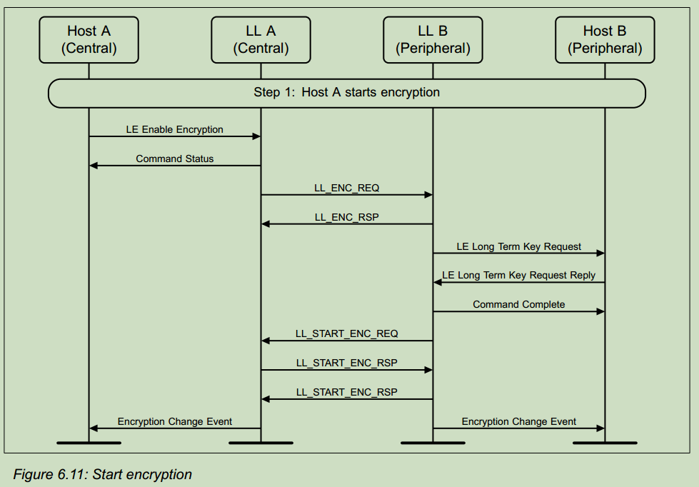

在加密会话建立过程中，Central 会向 Peripheral 发送一个 16 位的加密多样化值（EDIV）和一个 64 位的随机数（Rand），这些值是在配对过程中由 Peripheral 分发的。Central 的 Host 层会向 Link Layer 提供 LTK，用于建立加密会话。Peripheral 的 Host 则接收 EDIV 和 Rand 值，并向其链路层提供一个长期密钥，用于建立加密链路。

当双方设备都支持 LE Secure Connections 时，EDIV 和 Rand 的值被设置为零。

### Pairing Confirm

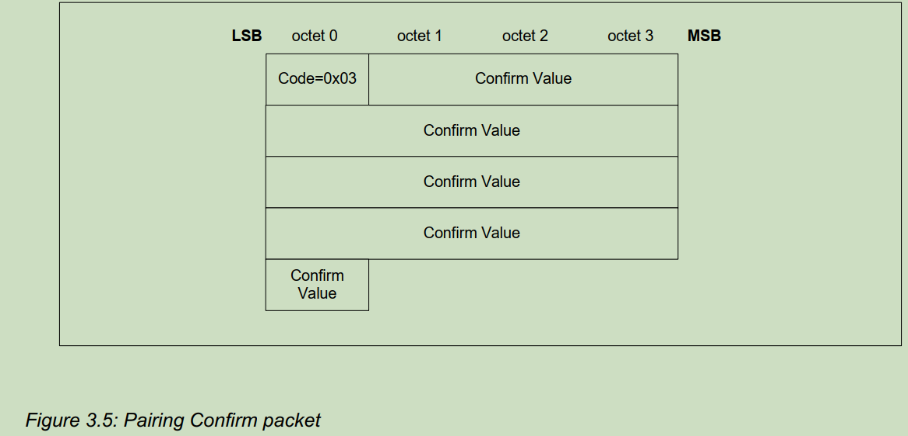